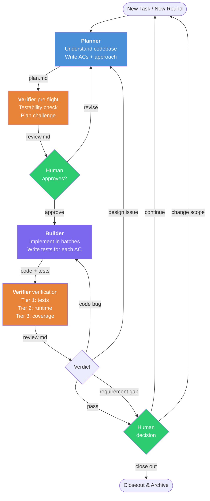
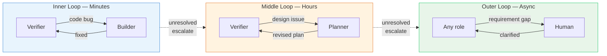

# Baton

A lightweight harness for AI-assisted software development. Three roles, three artifacts, round-based progressive elaboration.

Based on [Anthropic's harness design for long-running apps](https://www.anthropic.com/engineering/harness-design-long-running-apps) (Generator-Evaluator GAN pattern).

## Why

AI coding agents face three core problems:

1. **Self-evaluation leniency** — AI cannot honestly evaluate its own work
2. **Context loss over long tasks** — conversation history degrades over time
3. **Requirements emerge through building** — upfront specs are always incomplete

Baton addresses each with a specific mechanism: independent verification, file-based communication, and round-based progressive elaboration.

## Structure

```
v2/
├── protocol.md                        Full protocol spec
├── CLAUDE.md                          Quick reference
├── skills/
│   ├── dispatch/
│   │   ├── SKILL.md                   Public entrypoint — state detection & routing
│   │   ├── routing.md                 State detection, routing, bootstrap
│   │   └── checkpoints.md             Human checkpoints and lifecycle transitions
│   ├── planner/
│   │   ├── SKILL.md                   Public entrypoint — planning contract
│   │   ├── profile.md                 Project-profile generation
│   │   ├── planning.md                Round 1 / Round N planning
│   │   └── revision.md                Verifier-driven design revision
│   ├── builder/SKILL.md               Implementation with batch compile strategy
│   └── verifier/
│       ├── SKILL.md                   Public entrypoint — verification contract
│       ├── preflight.md               Pre-flight plan challenge
│       ├── verification.md            Tier 1 / 2 / 3a verification
│       ├── cross-model.md             Cross-model review via codex-plugin-cc
│       └── adversarial.md             Adversarial testing (security/boundary)
├── templates/
│   ├── project-profile.template.md    Project-level persistent knowledge
│   ├── plan.template.md              Per-task living document
│   └── review.template.md            Per-round review output
└── tools/
    ├── archive-task.sh                Archive task state during closeout
    ├── check-consistency.sh           Verify protocol-to-downstream sync
    ├── validate-live-state.sh         Validate current project-profile / plan / review shape
    └── validate-round-sync.sh         Validate plan/review round alignment
```

## Roles

| Role | Reads | Writes | Key rule |
|------|-------|--------|----------|
| **Planner** | project-profile.md, plan.md, source code | plan.md (ACs, approach, batch plan) | Clarifying questions scale with complexity |
| **Builder** | project-profile.md, plan.md (current round) | Source code, tests, plan.md § Discoveries | Every AC gets a test |
| **Verifier** | project-profile.md, plan.md (ACs), test results | review.md | Never reads Builder's source code (Mode A/B) |

**Dispatcher** is the thin router — detects state from artifacts, routes to the right role. Makes no technical decisions.

## Round Lifecycle



## Artifacts

| Artifact | Location | Lifecycle |
|----------|----------|-----------|
| `project-profile.md` | Project root | Persistent across tasks — project conventions, traps, build commands |
| `.harness/plan.md` | `.harness/` | Per task — ACs, approach, `Open Decisions`, discoveries. Archived on completion |
| `.harness/review.md` | `.harness/` | Per round — verification findings, human judgment, `Routing Signals` |

## Quick Start

```
/dispatch          → detects state, routes to the right role
/dispatch <task>   → starts a new task
```

First time on a project? Dispatcher will invoke Planner to generate `project-profile.md` by scanning build files, test infrastructure, conventions, and traps.

The public commands stay stable (`/dispatch`, `/planner`, `/builder`, `/verifier`). Detailed procedures live in sibling role files under each role directory.

## Feedback Loops

Three nested loops at different speeds:



Unresolved issues auto-escalate up one level (see protocol.md § Rules for thresholds).

## Verifier Modes

Detected during pre-flight. Adapts to what the environment supports:

| Mode | Capabilities | Confidence |
|------|-------------|------------|
| **A** | Full: compile + test + app startup + DB | High |
| **B** | Partial: compile + test + DB assertions | Medium |
| **C** | Static: compile + test + code review | Lower |
| **C+** | Static + external AI reviewer | Medium |

## Utility Skills

| Skill | Purpose |
|-------|---------|
| `deep-research` | Systematic investigation of code, APIs, docs |
| `first-principles-planner` | Strategic planning from first principles |
