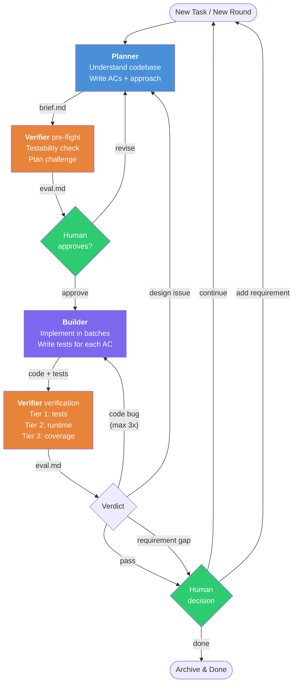
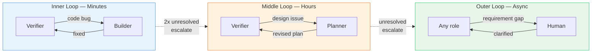

# Baton

A lightweight harness for AI-assisted software development. Three roles, three artifacts, round-based progressive elaboration.

Based on [Anthropic's harness design for long-running apps](https://www.anthropic.com/engineering/harness-design-long-running-apps) (Generator-Evaluator GAN pattern).

## Why

AI coding agents face three core problems:

1. **Self-evaluation leniency** — AI cannot honestly evaluate its own work
2. **Context loss over long tasks** — conversation history degrades over time
3. **Requirements emerge through building** — upfront specs are always incomplete

Baton addresses each with a specific mechanism: independent verification, file-based communication, and round-based progressive elaboration.

## Structure

```
v2/
├── protocol.md                        Full protocol spec
├── CLAUDE.md                          Quick reference
├── skills/
│   ├── dispatch/SKILL.md              Entry point — state detection & routing
│   ├── planner/SKILL.md               Codebase understanding, requirements, design
│   ├── builder/SKILL.md               Implementation with batch compile strategy
│   └── verifier/SKILL.md              Independent verification (pre-flight + post-build)
├── templates/
│   ├── project-profile.template.md    Project-level persistent knowledge
│   └── brief.template.md             Per-task living document
└── tools/
    └── archive-round.sh              Archive completed rounds
```

## Roles

| Role | Reads | Writes | Key rule |
|------|-------|--------|----------|
| **Planner** | project-profile.md, brief.md, source code | brief.md (ACs, approach, batch plan) | Max 3 clarifying questions |
| **Builder** | project-profile.md, brief.md (current round) | Source code, tests, brief.md § Discoveries | Every AC gets a test |
| **Verifier** | project-profile.md, brief.md (ACs), test results | eval.md | Never reads Builder's source code |

**Dispatch** is the thin router — detects state from artifacts, routes to the right role. Makes no technical decisions.

## Round Lifecycle



## Artifacts

| Artifact | Location | Lifecycle |
|----------|----------|-----------|
| `project-profile.md` | Project root | Persistent across tasks — project conventions, traps, build commands |
| `.harness/brief.md` | `.harness/` | Per task — ACs, approach, discoveries. Archived on completion |
| `.harness/eval.md` | `.harness/` | Per round — verification findings, human review guidance |

## Quick Start

```
/dispatch          → detects state, routes to the right role
/dispatch <task>   → starts a new task
```

First time on a project? Dispatch will invoke Planner to generate `project-profile.md` by scanning build files, test infrastructure, conventions, and traps.

## Feedback Loops

Three nested loops at different speeds:



If the same issue survives 2 Builder-Verifier cycles, it auto-escalates one level up.

## Verifier Modes

Detected during pre-flight. Adapts to what the environment supports:

| Mode | Capabilities | Confidence |
|------|-------------|------------|
| **A** | Full: compile + test + app startup + DB | High |
| **B** | Partial: compile + test + DB assertions | Medium |
| **C** | Static: compile + test + code review | Lower |

## Utility Skills

| Skill | Purpose |
|-------|---------|
| `deep-research` | Systematic investigation of code, APIs, docs |
| `first-principles-planner` | Strategic planning from first principles |
