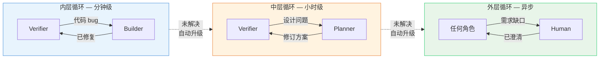

# Baton

一个轻量级的 AI 辅助软件开发 harness。三个角色，三个制品，基于轮次的渐进式需求细化。

设计参考 [Anthropic 关于长时间运行应用的 harness 设计](https://www.anthropic.com/engineering/harness-design-long-running-apps)（Generator-Evaluator GAN 模式）。

## 为什么

AI 编码代理面临三个核心问题：

1. **自我评估偏差** — AI 无法诚实评估自己的产出
2. **长任务中的上下文丢失** — 对话历史随时间退化
3. **需求在构建中浮现** — 前期规格说明永远不完整

Baton 用三个对应机制解决：独立验证、文件通信、轮次渐进。

## 结构

```
v2/
├── protocol.md                        完整协议规范
├── CLAUDE.md                          快速参考
├── skills/
│   ├── dispatch/SKILL.md              入口 — 状态检测与路由
│   ├── planner/SKILL.md               代码理解、需求澄清、方案设计
│   ├── builder/SKILL.md               实现（分批编译策略）
│   └── verifier/
│       ├── SKILL.md                   核心验证（预检 + Tier 1/2/3a）
│       ├── module-crossmodel.md       跨模型审查（codex-plugin-cc）
│       └── module-adversarial.md      对抗测试（安全/边界）
├── templates/
│   ├── project-profile.template.md    项目级持久知识模板
│   └── brief.template.md             任务级活文档模板
└── tools/
    ├── archive-round.sh              归档已完成的轮次
    └── check-consistency.sh          验证协议到下游文件的一致性
```

## 角色

| 角色 | 读取 | 写入 | 核心规则 |
|------|------|------|----------|
| **Planner** | project-profile.md, brief.md, 源代码 | brief.md（AC、方案、批次计划） | 澄清问题数量随复杂度缩放 |
| **Builder** | project-profile.md, brief.md（当前轮次） | 源代码、测试、brief.md § Discoveries | 每个 AC 必须有测试 |
| **Verifier** | project-profile.md, brief.md（AC）、测试结果 | eval.md | 验证时不读 Builder 的源代码（Mode A/B） |

**Dispatch** 是薄路由 — 从制品检测状态，路由到正确角色。不做技术决策。

## 轮次生命周期


## 制品

| 制品 | 位置 | 生命周期 |
|------|------|----------|
| `project-profile.md` | 项目根目录 | 跨任务持久 — 项目约定、陷阱、构建命令 |
| `.harness/brief.md` | `.harness/` | 每任务 — AC、方案、发现。完成后归档 |
| `.harness/eval.md` | `.harness/` | 每轮次 — 验证发现、人工审查指引 |

## 快速开始

```
/dispatch          → 检测状态，路由到正确角色
/dispatch <任务>   → 启动新任务
```

首次使用？Dispatch 会调用 Planner 扫描项目，生成 `project-profile.md`（构建配置、测试基础设施、编码约定、已知陷阱）。

## 反馈回路

三层嵌套循环，速度各异：



未解决的问题自动升级到上一层（阈值见 protocol.md § Rules）。

## Verifier 模式

预检时自动检测。根据环境能力自适应降级：

| 模式 | 能力 | 置信度 |
|------|------|--------|
| **A** | 完整：编译 + 测试 + 应用启动 + 数据库 | 高 |
| **B** | 部分：编译 + 测试 + 数据库断言 | 中 |
| **C** | 静态：编译 + 测试 + 代码审查 | 较低 |
| **C+** | 静态 + 外部 AI 审查 | 中 |

## 工具技能

| 技能 | 用途 |
|------|------|
| `deep-research` | 系统化调查代码、API、文档 |
| `first-principles-planner` | 基于第一性原理的策略规划 |
