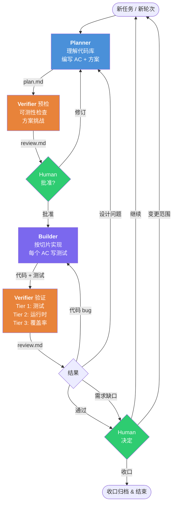
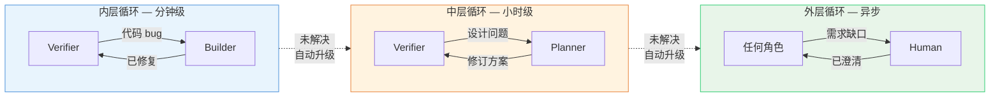

# Baton

一个轻量级的 AI 辅助软件开发 harness。三个公共角色，三个制品，基于轮次的渐进式需求细化。

设计参考 [Anthropic 关于长时间运行应用的 harness 设计](https://www.anthropic.com/engineering/harness-design-long-running-apps)（Generator-Evaluator GAN 模式）。

修改 Baton 核心行为前，先阅读 [CONTRIBUTING.md](/Users/hex1n/IdeaProjects/baton/CONTRIBUTING.md)。

## 为什么

AI 编码代理面临三个核心问题：

1. **自我评估偏差** — AI 无法诚实评估自己的产出
2. **长任务中的上下文丢失** — 对话历史随时间退化
3. **需求在构建中浮现** — 前期规格说明永远不完整

Baton 用三个对应机制解决：独立验证、文件通信、轮次渐进。

## 结构

```
v2/
├── protocol.md                        完整协议规范
├── CLAUDE.md                          快速参考
├── skills/
│   ├── dispatch/
│   │   ├── SKILL.md                   公共入口 — 状态检测与路由
│   │   ├── routing.md                 状态检测、路由、bootstrap
│   │   └── checkpoints.md             人工检查点与生命周期流转
│   ├── planner/
│   │   ├── SKILL.md                   公共入口 — 规划契约
│   │   ├── profile.md                 project-profile 生成
│   │   ├── planning.md                Round 1 / Round N 规划
│   │   └── revision.md                Verifier 触发的设计修订
│   ├── builder/
│   │   ├── SKILL.md                   公共入口 — 实现契约
│   │   ├── slices.md                 slice packet 的范围约束与上下文卫生
│   │   ├── workers.md                 内部 worker 契约与状态回传
│   │   └── isolation.md               `inline / advisory / isolated` delegation mode
│   └── verifier/
│       ├── SKILL.md                   公共入口 — 验证契约
│       ├── preflight.md               预检与方案挑战
│       ├── verification.md            Tier 1 / 2 / 3a 验证
│       ├── cross-model.md             跨模型审查附加层
│       └── adversarial.md             对抗测试（安全/边界）
├── templates/
│   ├── project-profile.template.md    项目级持久知识模板
│   ├── plan.template.md               任务级活文档模板
│   ├── review.template.md             每轮次审查输出模板
│   ├── slice-packet.template.md       Builder delegation packet 模板
│   ├── worker-report.template.md      供人读取的 worker report 模板
│   └── worker-report.template.json    供工具读取的 worker report 模板
└── tools/
    ├── archive-task.sh                在收口阶段归档任务状态
    ├── builder-slice.sh              host-neutral 的 Builder delegation helper
    ├── check-consistency.sh           验证协议到下游文件的一致性
    ├── external-review.sh             provider-neutral 的 C+ 审查适配层
    ├── validate-live-state.sh         验证当前 project-profile / plan / review 结构
    └── validate-round-sync.sh         验证 plan/review 轮次对齐

.context/
└── baton/
    ├── README.md                      scratch-state 契约说明
    └── active/                        被 git 忽略的运行时状态（external-review 任务、findings sidecar、探索笔记、slice packet、worker report）
```

## 仓库分层

| 层 | 位置 | 作用 |
|----|------|------|
| **Core** | `v2/` | 通用 Baton 协议、公共角色入口、模板、验证器 |
| **Companion** | `skills/` | 不属于 Baton 核心循环的可选辅助技能 |
| **External adapters / plugins** | `v2/tools/` 包装器或独立仓库 / 插件 | 宿主或供应商特定集成，避免进入协议核心 |

如果某个行为只对单一宿主、工具、团队或领域有价值，就不应进入 Baton core。

## 角色

| 角色 | 读取 | 写入 | 核心规则 |
|------|------|------|----------|
| **Planner** | project-profile.md, plan.md, 源代码 | plan.md（AC、Round Contract、Implementation Slices） | 澄清问题数量随复杂度缩放 |
| **Builder** | project-profile.md, plan.md（当前轮次） | 源代码、测试、plan.md § Discoveries | 唯一的 canonical mutator；可选内部 worker 仍受 Builder 边界约束 |
| **Verifier** | project-profile.md, plan.md（AC）、测试结果 | review.md | 验证时不读 Builder 的源代码（Mode A/B） |

**Dispatcher** 是薄路由 — 从制品检测状态，路由到正确角色。不做技术决策。

在 Standard / Full mode 下，Builder 可以把单个 slice 或 fix slice 委托给内部 worker，但这个 worker 不属于 Baton 角色，不能更新 `plan.md` / `review.md`，也不能直接向 human 提问。

## 轮次生命周期



## 制品

| 制品 | 位置 | 生命周期 |
|------|------|----------|
| `project-profile.md` | 项目根目录 | 跨任务持久 — 项目约定、陷阱、构建命令 |
| `.harness/plan.md` | `.harness/` | 每任务 — 轮次分类、预测、AC、`Round Contract`、方案、`Open Decisions`、发现。完成后归档 |
| `.harness/review.md` | `.harness/` | 每轮次 — 验证发现、人工判断、`Routing Signals`，以及可选的 findings-sidecar 指针 |
| `.context/baton/active/` | `.context/` | scratch only — 原始 external-review 状态、findings JSON、临时探索笔记、Builder slice packet、worker report |

## 任务分类

每个活跃轮次都会在 `plan.md § Metadata` 中携带 4 个分类字段：

| 字段 | 含义 |
|------|------|
| `Scope Class` | 当前轮次的规模 / 耦合等级，取值 `S1-S4` |
| `Risk Class` | 当前轮次的风险等级，取值 `R1-R3` |
| `Expected Rounds` | 整个任务大概还需要多少个 Baton 轮次的粗预测 |
| `Expected Slices This Round` | 当前轮次大概需要多少个 Builder slice 的粗预测 |

这几个层级不要混用：
- `Scope Class` 和 `Risk Class` 是分类。
- `Expected Rounds` 和 `Expected Slices This Round` 是预测。
- `Verifier Mode` 表示证据环境。
- `Execution Mode` 表示编排方式（`compact / standard / full`）。

## 快速开始

```
/dispatch          → 检测状态，路由到正确角色
/dispatch <任务>   → 启动新任务
```

首次使用？Dispatcher 会调用 Planner 扫描项目，生成 `project-profile.md`（构建配置、测试基础设施、编码约定、已知陷阱）。

然后 Planner 会先写出当前轮次的分类、预测和 `Round Contract`，Dispatcher 再据此确认 `Execution Mode`。

公共命令保持不变（`/dispatch`、`/planner`、`/builder`、`/verifier`），细节步骤下沉到各角色目录里的同级职责文件。

## 反馈回路

三层嵌套循环，速度各异：



未解决的问题自动升级到上一层（阈值见 protocol.md § Rules）。

## Verifier 模式

预检时自动检测。根据环境能力自适应降级：

| 模式 | 能力 | 置信度 |
|------|------|--------|
| **A** | 完整：编译 + 测试 + 应用启动 + 数据库 | 高 |
| **B** | 部分：编译 + 测试 + 数据库断言 | 中 |
| **C** | 静态：编译 + 测试 + 代码审查 | 较低 |
| **C+** | 静态 + 通过适配层接入的外部审查 | 中 |

## Companion Skills

| 技能 | 用途 |
|------|------|
| `using-baton` | Baton 仓库的薄启动守门：从 `/dispatch` 进入、优先读 canonical artifacts、收口前跑 validator |
| `deep-research` | 系统化调查代码、API、文档 |
| `first-principles-planner` | 基于第一性原理的策略规划 |

这些都属于 companion skills；Baton core 不应依赖它们才能运转。

## 贡献护栏

- protocol、角色文件、模板、验证器和投影文档都应视为“塑造行为的代码”。
- 规则变化先改 `v2/protocol.md`，再同步下游投影。
- 宿主特定细节不要写进协议核心和公共角色入口。
- Builder delegation 必须留在 Builder 内部。内部 worker 不能变成公共角色，也不能获得控制面权限。
- 改 core 后运行 `bash v2/tools/check-consistency.sh`。
